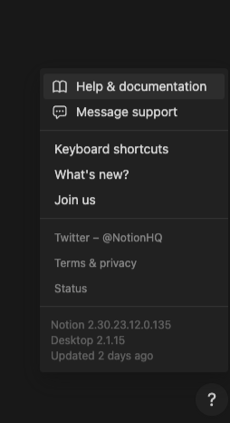

# Feedback Button

# Overview

The IntelliJ IDEA ZK plugin is a valuable tool that helps users to develop applications more quickly and easily. We can use this plugin to collect user feedback. This proposal outlines the benefits of adding a feedback feature to the ZK plugin and how it would be implemented.

# Difference from Website Feedback

I suppose those developers who download ZK plugin in their IDEA actually develop a ZK app. So collecting their feedback is more valuable than those visitors who just visit our website.

# Benefits

There are several benefits to adding a feedback feature to the ZK plugin. 

First, it would allow users to provide feedback, including bug reports, feature requests, and general feedback. This information would be valuable in improving the plugin or framework and making it more user-friendly.

Second, the feedback feature would make it easier for users to report bugs and request features. Currently, users have to create tickets on Freshdesk or email feedback. This feedback sends to [info@zkoss.org](mailto:info@zkoss.org).

Third, the feedback feature would show users that the developers are committed to listening to their feedback and making the plugin better. This would help to build goodwill with users and encourage them to continue using the plugin.

Encourage user interactivity.

# Existing Similar Examples

There are many existing examples of feedback forms in other products. Here are a few examples:

## Google Chrome

Google Chrome has a feedback form that users can use to report bugs, suggest features, or provide other feedback.

## Notion

# Feedback feature

The feedback feature could be implemented by adding a **?** (question mark icon/button) at the bottom-right corner in a zul file like Notion provides.
For non-zul files, do nothing.
When clicking the icon, it shows items:
* Customer Support
* Documentation
* Feedback 
* What’s New

- Customer Support: open the default browser to visit https://potix.freshdesk.com/
- Documentation: open the default browser to visit zk Developer's Reference website: https://docs.zkoss.org/zk_dev_ref/ 
- Feedback: https://www.zkoss.org/support/about/contact
- What’s New: open the default browser to visit the News page

# UI design evaluation
The evaluation of potential UI placements for the ZK Plugin feedback feature prioritizes strict adherence to JetBrains UX conventions, which emphasize minimalism and contextuality. Placing the action on the **Main Toolbar** was rejected because this area is reserved for high-frequency, critical developer functions (like VCS and Run/Debug), and integrating a low-frequency utility here violates the principle of UI minimalism and contributes to visual clutter. The option of a **Floating Editor Button** was also rejected as it violates the principle of contextuality; floating elements within the IntelliJ editor are strictly reserved for code-related operations such as refactoring or quick fixes that are triggered by a code selection, not for global plugin support.

Consequently, the primary recommendation is to integrate the feedback links as a nested Action Group within the main IDE's **Help Menu**. This placement is the canonical standard for auxiliary features, support links, and documentation, consuming zero persistent visual screen real estate. By using a nested group, the plugin can offer multiple clear options (e.g., "Report Bug," "Suggest Feature") while ensuring high discoverability; any action registered here is automatically indexed and searchable via the IDE’s global "Search Everywhere" function, providing predictable access for the user.

# Design Consideration: Action Implementation Strategy

A common desire when creating multiple similar actions—like opening different URLs—is to write a single, reusable action class and parameterize it from `plugin.xml`. While this approach seems efficient, it is an anti-pattern in the IntelliJ Action System. The chosen implementation of creating separate, stateless action classes for each menu item is a deliberate and critical design decision based on the following platform constraints:

### 1. Action Instantiation from `plugin.xml`

When the IDE loads the plugin, it parses the `<actions>` section in `plugin.xml`. For each `<action>` tag, it instantiates the specified class using its **default, no-argument constructor**. The `plugin.xml` schema provides no mechanism to pass arguments (like a URL string) to the constructor during this process. An attempt to register a reusable `OpenUrlAction` with a `url` field would fail, as the field would never be initialized, leading to a `NullPointerException` when the action is triggered.

### 2. Memory Safety and Statelessness

A core principle of the IntelliJ Action System is that actions must be **stateless**. Action classes should not contain instance fields (non-static variables). The IntelliJ Platform may reuse action instances across different contexts and windows, and holding state can lead to unpredictable behavior and, more importantly, **memory leaks**. An action holding a reference to a URL string or other data prevents that data from being garbage collected, even if the context in which it was created is long gone.

### The Correct, Idiomatic Approach

The correct and recommended pattern is to create a separate, simple class for each action.

-   **Stateless and Safe:** Each action class is completely stateless. The URL is defined as a `private static final String`, which is a compile-time constant and not part of the object's state. This guarantees memory safety.
-   **Clear and Explicit:** The `plugin.xml` file clearly maps a specific user action to a dedicated class whose purpose is self-evident.
-   **Reliable:** This approach is guaranteed to work correctly with the platform's lifecycle and instantiation logic.

While it involves a small amount of code repetition, this pattern ensures stability, safety, and compliance with the fundamental design principles of the IntelliJ Platform.