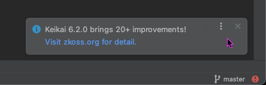

#  News Popup Feature Improvement - Enhanced Specification

## Feature 1. show news popup more frequently
**Requirements**: Show a new popup when:
1. The latest news content changed and was different from the cached one
2. No cached news exists
3. The latest news content equals to the cached one but it's over 7 days since last shown

### File Format
Java Properties format for JDK built-in support
```properties
lastShown=1234567890000
content=Latest ZK Framework news content here...
```
e.g. in mac, the file is at /Users/username/Documents/workspace/PLUGIN/zkidea/build/idea-sandbox/system/plugins/zkidea/zkNews.properties

**Key Design Decisions**:
- Use Properties format for JDK built-in support (`java.util.Properties`)
- Store timestamps as epoch milliseconds (UTC-agnostic)

### Logic Flow
1. **Cache Check**: Load `zkNews.properties` using `Properties.load()`
2. **Migration**: ignore old format new cache file.
3**Time Check**: Compare `lastShown` timestamp with current time
5. **Display Logic**: Show popup if:
    - No cache exists (first run), OR
    - More than configured days since `lastShown`, OR
    - Content has changed
6. **Update Cache**: Write new properties with current timestamp and content

### Thread Safety & Concurrency
simple design, ignore this case.

### File Operations
- **Directory Creation**: Ensure cache directory exists with proper permissions
- **Backup Strategy**: Keep previous cache file as `.bak` during updates

### Error Handling Strategy
just write a log

### Time Calculations & Configuration
```java
    private static final int INTERVAL_DAYS = 7;
```

### Testing Strategy

### User Experience Enhancements
- **Accessibility**: Screen reader compatible notifications
- **Error Recovery**: Never show error dialogs to users, graceful degradation only

## Feature 2. news popup requires users to close
Current popup screenshot at . It's closable.

**Requirements**: Transform auto-dismissing notification to user-controlled popup
- Remove auto-dismiss timer from the current implementation
- Persist popup until user interaction


### Performance Optimizations
from com.intellij.openapi.startup.ProjectActivity javadoc
> Runs an activity after project open. execute gets called inside a coroutine scope spanning from project opening to project closing (or plugin unloading). Flow and any other long-running activities are allowed and natural.

So a long operation inside doesn't affect intellij. 

## Implementation Priority (Revised)
1. **Phase 1**: Core Properties format and enhanced error handling
2. **Phase 2**: Thread-safe cache service with configuration
3. **Phase 3**: Sticky popup UI and link functionality
4. **Phase 4**: Performance optimizations and comprehensive testing
5. **Phase 5**: Migration support and backward compatibility

## Files to Modify
### Core Implementation
- `src/main/java/org/zkoss/zkidea/newsNotification/ZKNews.java` - Main service logic

### Testing
- `src/test/java/org/zkoss/zkidea/newsNotification/ZKNewsTest.java` - Enhanced unit tests


## Security & Compliance Considerations
- no need content validation since it comes from our zk official website
- **File Permissions**: Ensure cache files have appropriate permissions (600)
- **Data Privacy**: No personal data collection, only anonymous usage patterns
