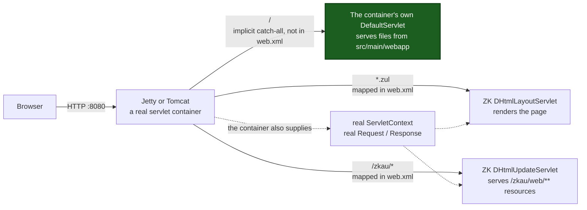
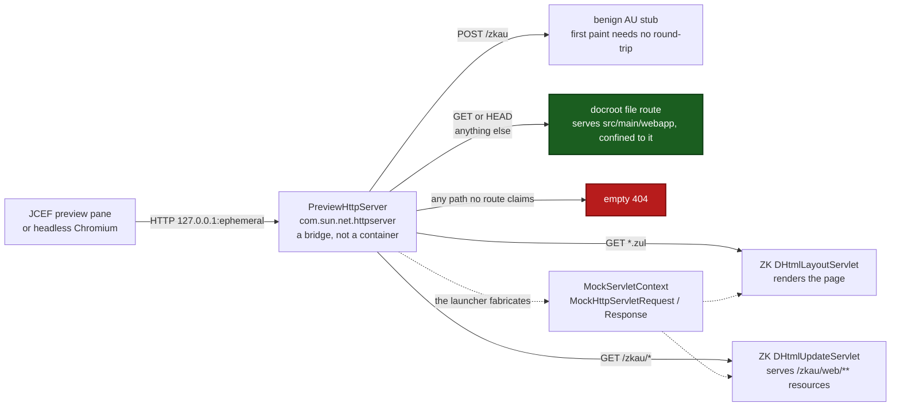
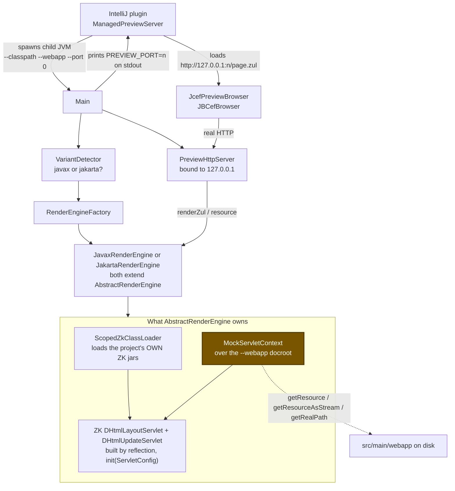
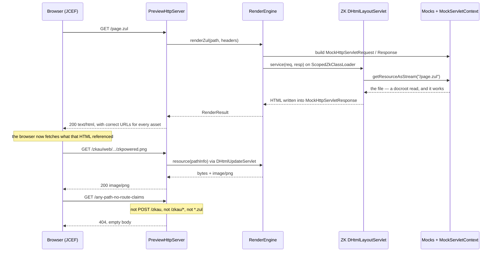

# Why the ZUL Layout Preview runs without a servlet container

**Status:** reference. Describes `zk-preview-launcher` as of version 1.0.3.
**Last verified:** 2026-08-31, against the 1.0.3 source tree and a live launcher process.

The Layout Preview renders a `.zul` page by driving ZK's real rendering servlets inside a helper
JVM that contains **no Jetty, no Tomcat, and no servlet container of any kind**. Because that is
the opposite of how a ZK application normally runs — and because ZK's own documentation
recommends a hot-reloading Jetty for development — the arrangement reads as surprising, and the
reasoning behind it is easy to lose. This document records it.

It covers what ZK actually requires in order to render a page, which alternatives were evaluated
and why each was rejected, what was built instead, and which properties of the result follow
directly from having no container.

---

## 1. Summary

There is no Jetty dependency in the `zk-preview-launcher` module, and no reference to Jetty,
Tomcat, Undertow or Catalina anywhere in its sources or `build.gradle`.

The reason is not that a container would have been too slow. Ranked by the weight they carried in
the decision:

1. **Class isolation.** The preview must never load the user's own ViewModel or Composer classes.
   The container-based route available at the time resolves exactly those classes off the host
   classpath, with no supported way to suppress it.
2. **Bundling cost.** An embedded container would have to ship **twice** — the `javax.servlet` /
   `jakarta.servlet` split that separates ZK 9.x from ZK 10.x is a Jetty major-version boundary.
3. **Licence and availability** of the specific container-based library considered.
4. **A working mock-servlet prototype already existed**, making it the cheapest path to a
   demonstrable result.

The frequent framing "rendering a `.zul` requires Jetty" is one step too strong. The accurate
statement is:

> ZK's renderer **is a servlet** — `org.zkoss.zk.ui.http.DHtmlLayoutServlet`. A servlet requires
> the **servlet API contract**: a `ServletContext`, an `HttpServletRequest`, an
> `HttpServletResponse`. It does not require a servlet *container*.

Jetty is one implementation of that contract. The launcher is another, deliberately minimal one —
six small mock classes per servlet namespace. The two are **alternative implementations of the
same contract**, never layered on one another.

## 2. What rendering a ZUL actually requires

Two facts constrain every possible design. Both were established by measurement before the
architecture was chosen.

**The page response is a bootstrap, not finished HTML.** A `.zul` request returns an HTML skeleton
whose `<body>` holds only a loading placeholder, plus a script of the form
`zkmx([0,'dYFV_',{…},{},[ …widget tree… ]])`. Each node in that tree is
`['<widgetClass>','<uuid>',{props},{},[children]]`. The browser's ZK Client Engine constructs the
component DOM entirely client-side from that descriptor. Producing it requires ZK's own
interpreter and `UiEngine` — there is no server-rendered per-component HTML to capture.

**ZK's own client resources cannot be served as static files.** Most of what the page's `<head>`
requests needs server-side processing:

* `.wpd` files are XML *Web Package Descriptors*, not JavaScript. `zk.wpd` contains
  `<package name="zk"><script>window.zk={}</script><function class="org.zkoss.zk.ui.http.Wpds"
  signature="java.lang.String outLibraryPropertyJavaScript()"/><script src="index.js"/>…</package>`
  — embedded server-side Java calls whose output is inlined at serve time by `WpdExtendlet`.
* `.css.dsp` files are ZK Dynamic Server Pages. `norm.css.dsp` opens with
  `<%@ taglib uri="http://www.zkoss.org/dsp/web/core" prefix="c" %>` and JSP-like conditionals
  evaluated server-side.
* `zk.wcs` is XML that generates CSS through per-language functions.

The conclusion recorded at the time: *"A 'dumb static file server that extracts from jars' is NOT
sufficient for either part in the general case; a minimal embedded ZK servlet stack
(`DHtmlLayoutServlet` + `DHtmlUpdateServlet`/`ClassWebResource`, or equivalent programmatic use of
`UiEngine` + extendlets) is the load-bearing requirement."*

So ZK server-side code is mandatory. The open question was only **what hosts it**.

## 3. The options that were evaluated

Four approaches were assessed and recorded with verdicts before any of the current code was
written. The table below is reproduced from that assessment; the wording of each verdict is
preserved.

| Approach | Verdict | Recorded reason |
|---|---|---|
| **Helper JVM + mock-servlet core + JDK `HttpServer`** | **SELECTED — built & verified** | A working prototype already rendered ZUL by driving `DHtmlLayoutServlet` with mock servlet objects. *"No Jetty to bundle; ZK's real engine does all the work."* To be extended with resource serving (`DHtmlUpdateServlet`/`ClassWebResource` for `/zkau/web/*`), isolation hooks, and an HTTP bridge for JCEF. |
| **Helper JVM + embedded Jetty + real webapp** | **Contingency — never activated** | *"Highest-fidelity servlet environment, proven shape (ZATS does exactly this internally). Cost: plugin must bundle Jetty (jakarta AND javax variants). Trigger: activate only if [the selected approach] fails its resource-serving gate within the loop limits."* |
| **ZATS Mimic** (ZK's own testing harness) | **Killed** | *"ZATS internally = embedded Jetty + production servlets (nothing lighter); raw HTML not exposed by public API; GPL-2.0; not on Maven Central; zero isolation."* Only its adapter-include concept was reused as an idea, not as a dependency. |
| **Static approximation, no ZK runtime** | **Dropped** | *"Even ZK's own JS/CSS can't be served statically (`.wpd`/`.wcs`/`.dsp` need server-side extendlet processing — verified: `zk.wpd` embeds `<function>` calls). A no-runtime preview would be misleadingly low fidelity."* Noted as a possible future fallback for when JCEF is unavailable. |

Note the shape of that decision: the embedded-Jetty option was **not discarded**. It was kept as a
named contingency with an explicit activation trigger, and the trigger never fired.

### 3.1 Why the container-based route could not meet the isolation requirement

The hard constraint on the whole feature is that the preview **never loads the user's own
ViewModel or Composer classes**. The only proven embedded-container shape available was the one
inside ZATS Mimic, and it is structurally incompatible with that constraint.

ZATS boots a real embedded Jetty `WebAppContext` bound to `127.0.0.1` on an ephemeral port inside
the same JVM, then issues a genuine `HttpURLConnection` GET against it. Its emulator sets:

```java
contextHandler.setParentLoaderPriority(true);
```

The finding recorded against that line:

> The embedded `WebAppContext` sets `parentLoaderPriority=true`, meaning classes are resolved off
> the host JVM's own classpath before the webapp's isolated classpath — so any ViewModel/Composer
> class referenced by the ZUL and present on the host process's classpath will be found and
> instantiated by ZK's own binder/composer machinery during rendering.

And the consequence:

> ZATS is purpose-built to instantiate and unit-test those exact classes, and there is no
> supported switch to suppress that; it directly conflicts with the "never load user-project
> classes" constraint.

Two secondary facts were recorded about the same route: ZATS is GPL-2.0 and distributed only
through ZK's own Maven repository, not Maven Central; and it carries embedded Jetty
(`org.eclipse.jetty:jetty-webapp`) plus, on older javax versions, Rhino as its own runtime
dependencies.

Building a *fresh* embedded-Jetty host — rather than reusing ZATS — remained possible, and that is
exactly what the contingency option was. Its recorded cost was the twofold bundle: the plugin
would have to ship a jakarta-era and a javax-era container to cover both ZK generations.

### 3.2 Prior art pointed the same way

A survey of every other ZUL preview tool found no reusable in-process pattern:

> No prior-art tool provides a reusable pattern for safely rendering arbitrary ZUL while excluding
> user classes in-process — both ZK Studio's dead Visual Editor and zkfiddle solved isolation by
> running a full separate ZK webapp/server (Jetty/Tomcat), not by sandboxing within a single
> process.

ZK Studio's Visual Editor has been gone since ZK Studio 2.0.0, its source was never published, and
ZK's own current recommendation in its place is to run the full webapp under a hot-reloading
Jetty or Tomcat. zkfiddle (last commit 2012) proxied to separate, independently-running
`zksandbox.war` deployments — one per ZK version. In both cases isolation came from *separate
deployments*, not from sandboxing inside one process.

That is evidence for a standalone helper process, which is what was built. It is not evidence for
a container inside that process.

## 4. What was built: two mechanisms for two problems

The launcher solves two unrelated problems. Most of the confusion about its shape comes from
assuming one component solves both.

| | Problem | What it requires | What the launcher uses |
|---|---|---|---|
| **A** | Drive ZK's renderer | the servlet API contract | `MockServletContext`, `MockHttpServletRequest`/`Response` — **no socket** |
| **B** | Get the result onto a screen | a real TCP socket serving `http://` | `PreviewHttpServer` on `com.sun.net.httpserver` — **no servlet API** |

Problem B exists because the preview pane is a real Chromium — IntelliJ's JCEF, via
`JBCefBrowser` — and headless screenshotting drives a real browser too. A browser loads URLs, not
Java objects. Mock objects cannot supply a URL, so a real listening socket is unavoidable. That
socket is bound to loopback explicitly:

```java
this.httpServer = HttpServer.create(new InetSocketAddress("127.0.0.1", port), 0);
```

So: **the mocks are not present because a socket was impossible, and the socket is not present
because the mocks were insufficient.** They answer different questions. `PreviewHttpServer` is a
*bridge*, not a container — it terminates HTTP and hands off; it implements no servlet API.

## 5. Diagram — a real deployment



Three routes, but `web.xml` declares only two of them. ZK's two servlets are written down; the
container's `DefaultServlet` is implicit, contributed by the container itself, and is what makes a
project's own images, stylesheets and scripts load.

## 6. Diagram — the preview launcher



## 7. What the two share, and the one route that differs

Both mount **the same two ZK servlets**, at the same two URL patterns. The launcher's `.zul`
rendering and its `/zkau/web/**` resource serving are not reimplementations of ZK behaviour — they
are ZK's own servlets, instantiated by reflection and driven directly. Fidelity for those two
paths is therefore high by construction.

What the launcher had no equivalent of, for its first three releases, was the container's implicit
`DefaultServlet`. Because that servlet is never written down in `web.xml`, porting "the servlets a
ZK webapp declares" produced a complete-looking result that silently omitted it: no file from the
project's own docroot was served at all. The docroot file route added in 1.0.3 is the deliberate
stand-in, and it is deliberately last in precedence so it can never answer a request either ZK
servlet would have handled.

The standing consequence is that **the launcher's router is an allowlist**. A real container
answers a request for a docroot file whether or not anyone thought about that file; the launcher
answers only the paths `PreviewHttpServer.handle` names, and anything unnamed falls through to a
bare 404. So any behaviour a container would have contributed implicitly has to arrive here as an
explicit route — which is a thing to check for deliberately, because nothing in `web.xml` lists
what a container was doing for free.

## 8. Diagram — launcher internals



Two properties this makes visible.

**The launcher has zero ZK compile dependencies.** It must render against whatever ZK the user's
project pins, which is why `ScopedZkClassLoader` loads the project's own jars and every ZK type is
reached by reflection. The mock classes implement both servlet namespaces in a single source set,
because `javax.servlet.*` and `jakarta.servlet.*` are different Java packages and never collide.
This is the concrete form of the bundling argument in §3: one source set covers both generations,
where an embedded container would need two builds.

**The docroot plumbing already exists.** `MockServletContextCore.resourceFile` resolves a request
path against the docroot, normalises it, and returns `null` if it escapes:

```java
Path root = webappDir.normalize();
Path resolved = root.resolve(relative).normalize();
if (!resolved.startsWith(root)) {
    return null;
}
```

`PreviewHttpServer.readZulSource` performs the same resolve-and-confine, in the very class that
terminates HTTP, in order to quote a broken `.zul` into its error page. Both already hold
`webappDir`. This sharpens §7's point: reading the docroot and *routing* to the docroot are
independent, and it is the routing half that is scarce here.

## 9. Diagram — one page render, request by request



Note where the docroot is actually read. The `.zul` file itself comes off disk — but through
`MockServletContext`, because ZK's servlet asks the context for it, not because any route reads
files. Routes and context resource lookups are two independent doors onto the same directory, and
a path reachable through one is not thereby reachable through the other.

## 10. Guidance for changing the routing

`PreviewHttpServer.handle` is an ordered `if`-chain over method and path: `POST /zkau`,
`GET /zkau/*`, `GET *.zul`, the docroot file route for `GET`/`HEAD`, then a bare 404. Handler
precedence is that order, and any new route must be added such that it never sees a request an
earlier one would have answered — in particular a `.zul` must keep being rendered as a page and
must never be returned as source text.

Properties that already hold, and should be preserved rather than reintroduced:

* **Loopback-only bind** — `new InetSocketAddress("127.0.0.1", port)`.
* **Component-wise docroot containment** — `Path.startsWith` compares name elements, not string
  prefixes, so a docroot of `/home/u/app` already rejects `/home/u/app-secrets/x`.
* **No caching on rendered pages** — the pane re-requests the same URL on every save, so
  `Cache-control: no-store, no-cache, must-revalidate` and `Pragma: no-cache` are set on `.zul`
  responses deliberately. Any new route serving editable files needs the same treatment; a `304`
  would show a previous version of a file the developer just changed.

One rule about verifying such a change, learned the hard way on this subsystem: **a fixture
assembled only from framework-supplied parts cannot detect a gap in serving application-supplied
parts.** Every early fixture here was a ZK page whose `<head>` URLs are all ZK's own classpath
resources under `/zkau/web/**`, so no amount of passing could distinguish "serves resources" from
"serves ZK's resources". Any gate on the routing needs at least one fixture referencing an asset
the *project* owns.

Two known limitations that a new route must account for rather than inherit:

* **`MockServletContextCore.getMimeType` always returns `null`.** A route that serves files must
  own its own extension-to-MIME mapping; delegating to the servlet context yields no
  `Content-Type`, and a strict browser then refuses the asset. The docroot route therefore carries
  its own table (`PreviewHttpServer.contentType`).
* **Both existing containment guards are lexical, and stay that way.** `normalize()` does not
  resolve symbolic links, so a symlink inside the docroot pointing outside it is served. This is a
  **documented non-goal** as of 2026-08-31, not a pending fix. A docroot-bounded `toRealPath()`
  would 404 legitimate assets, because a preview docroot is a live source tree where symlinked
  asset folders are normal; and the threat model does not justify it, since previewing an untrusted
  project already grants code execution in the launcher JVM through `<zscript>` — reading one file
  through a link is a strict downgrade from that. The launcher is a developer tool bound to
  loopback and pointed at the developer's own tree; it is not a server for untrusted content. If
  the decision is ever revisited, bound the real-path check by the project's **content roots**,
  never by the docroot.

## 11. Related material

* [`doc/zul_preview_spec.md`](zul_preview_spec.md) — the feature specification, including the
  requirement numbering (`FR-14` is this HTTP bridge) and the risk register.
* [`doc/feature_overview.md`](feature_overview.md) §10 — the preview subsystem's class-by-class map.
* [`manual-test/src/main/webapp/preview/static/`](../manual-test/src/main/webapp/preview/static/) —
  docroot static-asset fixtures and their probe script.
* The static-asset serving requirements currently live in
  `tasks/launcher-static-asset-serving-spec.md` and move into this directory once the
  implementation lands and the requirements are settled.
