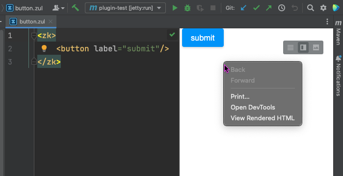

# Layout Preview for ZUL files

*Feature guide — ZK plugin for IntelliJ IDEA 1.0.0*

The **Layout Preview** adds a side-by-side preview to the `.zul` editor: the left pane is
the normal ZUL text editor, the right pane shows the **actual HTML ZK's own engine
produces for the page's first paint**, refreshed when you save. It is a *layout* view —
how the page composes and lays out — not a running application.

> **Mental model.** The preview renders through your project's **own ZK jars** in an
> isolated helper process. Your own code is **never loaded** — ViewModels, Composers,
> converters and validators do not run. So a data-bound value shows as a **placeholder**
> (the binding expression text), not real data. Think "see the skeleton of the page as I
> type", not "run my app".

For the engineering contract and the full limitation list see
[zul_preview_spec.md](zul_preview_spec.md); for the class-by-class implementation map see
[feature_overview.md §10](feature_overview.md).

---

## Using it

1. Open any `.zul` file. The editor opens as a split: **text on the left, Layout Preview
   on the right.** (You can switch to editor-only / preview-only / split with the usual
   three buttons in the top-right of the editor.)
2. Edit as normal. **Save (⌘S / Ctrl+S)** to refresh the preview — the render updates a
   fraction of a second after the file is written to disk. Unsaved edits do not refresh.
3. The first time a page renders, a one-line banner reminds you that binding values are
   placeholders because your ViewModel does not run here. Click **Got it** to dismiss it
   for good.

Only `.zul` files get the split. Other ZK XML (`zk.xml`, `lang-addon.xml`) keeps the plain
XML editor.

---

## What renders — and what doesn't

| You wrote | In the preview |
|---|---|
| Components, attributes, layout (`window`, `grid`, `hlayout`, styles, …) | **Rendered** — real ZK HTML/CSS, real widget geometry |
| EL implicit objects — `${desktop}`, `${execution}`, `${page}`, scopes, `${param}`, … | **Live** — resolved by ZK's real page-evaluation runtime (24 of 25 resolve; `event` is null because no event is dispatched at render time) |
| Plain EL over page data — `${zscript-created-var}`, `forEach` lists, `<variables>` | **Evaluated** |
| MVVM bindings — `@load`, `@bind`, `@init`, `@save`, `@command` | **Placeholder** — the expression text is shown in a dimmed italic style; the ViewModel is never instantiated |
| Model-bound data components — `<grid model="@load(vm.rows)"/>`, listbox, tree | **Placeholder rows/nodes** — a few dimmed sample rows so the component keeps its real geometry instead of collapsing to an empty box |
| `apply="a.MyComposer"` / auto MVVM `BindComposer` | **No-op** — user composers never run (that is the isolation guarantee) |
| Client-side namespace `w:` (e.g. `w:onClick="…"` JS) | **Runs** — it is client JavaScript, executed in the preview browser |
| Server-side event listeners (`onClick` → Java), AU round-trips (paging, sort, tree-expand) | **Not simulated** — first paint only; interactions are silent no-ops |
| `<zscript>` (inline Java) | **Runs at compose time** — a missing class produces a formatted error, not a crash |

This split is deliberate and permanent: implicit objects are part of *laying out the page*,
while bound data is part of *running your application* — which the preview intentionally
does not do.

---

## Verified coverage

The renderer is exercised by a **ZUML syntax corpus** run against the real ZK engine on **both**
servlet variants (javax / ZK 9.6 and jakarta / ZK 10) — every case produces the *same* outcome on
both:

- **15 ZUML construct groups**, each with multiple cases: elements & attributes (incl. the long-form
  `<attribute>`), EL `${…}`, `if` / `unless`, `forEach`, `<zk>` grouping, namespaces, native `n:`
  passthrough, client `w:` listeners, `<zscript>`, processing instructions (`<?page?>`,
  `<?component?>`, `<?variable-resolver?>`), custom-attributes, `<variables>`, MVVM annotations, and
  `<template>`. Each either **renders**, renders a **placeholder** (dynamic/bound value), or **fails
  gracefully** with a structured error — never a raw crash.
- **EL implicit objects** — **24 of the 25** reference objects resolve to *live* values (`self`,
  `page`, `desktop`, `execution`, `session`, `pageContext`, `spaceOwner`, the seven scope maps,
  `param` / `paramValues` / `cookie` / `header` / `headerValues`, `labels`, `zk`, `arg`, and
  `each` / `forEachStatus`); only `event` is `null`, which is correct — no event is dispatched during
  a first-paint render.

### Add-ons

Commercial and community add-ons render in the preview like core components — the add-on's own
widget markup and its JS/CSS both come through, so the page looks like the real thing rather than an
unstyled box. Verified against real jars, on both servlet variants:

| Add-on | Versions verified | In the preview |
|---|---|---|
| **ZK Charts** | 12.5.0.0 | **Renders**, styled |
| **ZK Calendar** | 3.2.1 | **Renders**, styled |
| **Pivottable** | 3.1.0 | **Renders**, styled |
| **Keikai** | 6.3.0, 5.12.0 | **Renders** — the full spreadsheet widget, no license or server push needed for first paint |
| **ZK CKEditor (ckez)** | 4.25.0.1-lts | **Renders**, styled |

Add-ons follow the same rules as everything else: **first paint only** (no server round-trips) and
the add-on jar must be on the module's IntelliJ classpath — a dependency that is commented out or
unresolved shows up as *"Unknown component"*, not as a broken preview. An add-on version pairing
that differs from the one it was built against is fine; the matrix deliberately covers mismatched
pairs. The exact matrix lives in [zul_preview_spec.md §8](zul_preview_spec.md).

---

## Supported project layouts

The preview serves the page from a **docroot** it infers from the file's location, so the
page renders at its real production URL and its includes/resources resolve the same way
they would on a server.

| Layout | Docroot used | Notes |
|---|---|---|
| **Maven / Gradle WAR** (`src/main/webapp/…`) | the `webapp` / `WEB-INF` ancestor | The classic layout; nothing to configure. |
| **Spring Boot *jar*** (`src/main/resources/web/…`) | the classpath `web` root | ZULs on the classpath, no `webapp`. Served at the production URL (`/index.zul`), and `~./` resources resolve from the classpath — matching a real ZK Spring Boot app. *(since 1.0.0)* |
| **Other / non-standard** | nearest content root, else the file's parent | Best-effort; a page under an unrecognized layout may not resolve every resource. |

**Includes and templates** resolve across all three ZK path forms, in the preview exactly
as on a server:

- absolute — `<include src="/foo.zul"/>` (from the docroot)
- relative — `<apply templateURI="../foo.zul"/>` (relative to the including page)
- classpath — `<include src="~./foo.zul"/>` (ZK `ClassWebResource`, from `/web` on the
  classpath — your module's resource roots are put on the render classpath so your own
  `~./` pages resolve, just like `WEB-INF/classes/web/` does in a container)

---

## Requirements

The preview renders when all of these hold; otherwise the pane shows a short explanation
instead.

1. **An embedded browser (JCEF).** The preview draws in a JCEF browser. If the IDE's boot
   runtime has no JCEF (some alternative JDKs) or JCEF is disabled, see *When JCEF is
   unavailable* below.
2. **ZK on the module's IntelliJ classpath.** The `.zul`'s module must have at least one
   ZK jar on its resolved runtime classpath *as IntelliJ sees it*. Maven and Gradle give
   you this automatically by declaring ZK as a dependency. A hand-configured project works
   too if ZK is attached as a module library. ZK sitting only in `WEB-INF/lib` on disk (not
   attached in IntelliJ) is **not** enough — the pane will say the module has no ZK.
3. **No build tool needed at render time.** The preview never runs `mvn`/`gradle` and never
   reads `pom.xml`/`build.gradle`; it reads only IntelliJ's resolved project model. The
   render helper is bundled inside the plugin.
4. **No particular project JDK.** The render helper needs Java 17, and it uses your project SDK
   when that SDK is 17 or newer — otherwise it quietly runs on the IDE's own runtime instead.
   A project on JDK 8 or 11 previews normally; you do not need to change its SDK, and doing so
   would not affect what the preview shows. (Your own code never runs in that JVM, so its Java
   version has no bearing on the render.)

---

## When JCEF is unavailable

If the embedded browser can't run, the preview **diagnoses why and offers a way through**
instead of just failing:

- **Reason.** It tells you the specific cause — the IDE's boot runtime lacks JCEF (switch
  the Boot Java Runtime to a JetBrains Runtime via *Find Action ▸ Choose Boot Java Runtime
  for the IDE*), or JCEF is disabled in the registry (`ide.browser.jcef.enabled`).
- **Fallback.** An **"Open preview in external browser ↗"** link renders the same page in
  your system browser — the preview server keeps working, only the *display* moves out of
  the IDE.

---

## Debugging a blank or wrong render

Not every disappointing preview is a *failure* — sometimes the page renders "fine" and your
component just isn't visible. Right-click inside the preview pane for two tools:




- **View Rendered HTML** — opens the pane's **live DOM** as a read-only editor tab
  (`<name>-rendered.html`), with the usual highlighting and Ctrl+F. This answers the
  question a blank pane can't: *is my component missing, or is it there but hidden?* If you
  find your `<button>` in the dump as a `z-button` div, the problem is CSS/geometry
  (`visible="false"`, zero height, a collapsed parent), not rendering. If it isn't in the
  dump at all, it never composed.
- **Open DevTools** — the full Chromium inspector (Elements, Console, Network). This is what
  finds the causes the DOM can't show you: a JavaScript error, or a `/zkau/web/*` resource
  that 404s (without those assets nothing paints at all). Reach for it when the pane is
  blank *and* the dump is empty.

Two notes on this:

- The dump is the **live DOM**, not the raw HTTP response — deliberately. A ZK page's
  response body is mostly a `zkmx([…])` bootstrap that the client engine expands into DOM,
  so the raw bytes would tell you far less than what you can actually see.
- The browser's own **View Source** entry is gone. It is dead in any embedded Chromium (it
  tries to open a tab, and the preview pane has no tab strip), so it was removed rather than
  left there doing nothing. **View Rendered HTML** replaces it.

Each **View Rendered HTML** click replaces the previous dump tab rather than stacking up new
ones. **Open DevTools** costs nothing until you click it; once opened, its window stays alive
until you close the preview tab.

---

## When a page fails to render

A parse error, a missing `<zscript>` class, or an invalid component hierarchy produces a
**formatted error page** in the preview pane (not a raw stack dump):

- the failure **phase** (parse / compose) and message,
- the failing **`file:line`** where ZK can report it,
- a collapsible **full stack trace**,
- a prefilled **"Report on GitHub"** link carrying the error, the failing `.zul` source,
  and your **render target** (below). For a report too large for a URL, the plugin hands
  the body off via the **clipboard** so nothing is truncated.

### What the report says about your setup

Because a render failure is almost always about *how the page was set up to render*, the
report describes that target, not just who was running:

```
Plugin:  ZKIdea 1.0.0
IDE:     IntelliJ IDEA 2024.3 (IU-243.1)
OS:      Mac OS X 15.7.3
JDK:     17.0.4.1
Build:   Maven                       ← Maven / Gradle / none (a hand-configured module)
Layout:  WAR webapp                  ← which docroot rule matched (see the table above)
Servlet: jakarta                     ← the variant detected from your own ZK jars
ZK jars: zkmax-10.1.0-jakarta.jar, zkex-10.1.0-jakarta.jar, zk-10.1.0-jakarta.jar, …
         [30 classpath entries]
```

The last three lines are what make a report actionable: the ZK jar list shows the version,
CE vs EE, and any dependency that failed to resolve (a missing `zkex` is visible as an
*absence*), while the layout explains include/`~./`/"page not found" failures. Only ZK jar
**file names** are listed — never full paths, and never your other dependencies.

`Servlet` appears only when the render helper actually started; the "cannot display
preview" cards report everything else.

---

## Under the hood (short version)

- Rendering runs in a **helper JVM** the plugin spawns — a small standalone "rendering core"
  (`zk-preview-launcher`) with zero IntelliJ dependencies — driving *your* ZK jars through
  ZK's real `DHtmlLayoutServlet`. Both `javax` and `jakarta` servlet variants are
  auto-detected and supported.
- **Isolation** rests on a scoped classloader (only ZK jars + isolation hooks; your
  compiled output is never on it) and a `UiFactory` hook that turns every composer/ViewModel
  resolution into a no-op. That is *why* bound values are placeholders — by design, not a
  bug.
- **One helper JVM per `(docroot, classpath)` pair**, shared by every preview tab that
  resolves to it, kept alive for the project session and killed when the project closes (no
  orphan processes).

Full details: [feature_overview.md §10](feature_overview.md) and
[zul_preview_spec.md](zul_preview_spec.md).

---

## Limitations (by design)

- **First paint only** — no server round-trips; server-side listeners and AU updates
  (paging, sorting, tree expansion) are not simulated.
- **No user-class fidelity** — ViewModels/Composers/converters never load, so MVVM values
  are placeholders and `@command` is unwired. This will not change; it is the isolation
  guarantee.
- **Refresh on save**, not on keystroke (≈300 ms after the file is written).
- **Idle helper JVMs** — one per distinct `(docroot, classpath)` stays up until the project
  closes (no idle timeout).

The full, itemized limitation list (L-1 … L-14) lives in
[zul_preview_spec.md §4](zul_preview_spec.md); the still-open review findings — bugs, not
design decisions — are tracked in [§5](zul_preview_spec.md) of the same file.

---

## Troubleshooting

| Symptom | Likely cause | Fix |
|---|---|---|
| Pane says the module has no ZK | ZK isn't on the module's IntelliJ classpath | Declare ZK as a Maven/Gradle dependency and reimport, or attach it as a module library. |
| Pane says ZK is declared but the jars aren't on disk | The dependency resolves in the build file but the local repository cache is missing/wiped | Re-import (Maven/Gradle sync) so the jars are downloaded again. |
| *"Unable to access jarfile …/zkidea-1.0.0.jar/lib/zk-preview-launcher.jar"* | The plugin was installed as a **single jar** — that artifact is a build intermediate and carries no render helper | Install the distribution **`.zip`** (`build/distributions/zkidea-<version>.zip`) via Settings ▸ Plugins ▸ ⚙ ▸ Install Plugin from Disk. A single-jar install is broken by construction (no launcher, no jsoup, uninstrumented). |
| Bound value shows as literal text (e.g. `vm.name`) | Expected — the ViewModel doesn't run in preview | Not an error. The same page on a real server shows the value. |
| A button/click/sort does nothing | Expected — first paint only; server round-trips aren't simulated | Client-side `w:` listeners *do* work; server logic is out of scope. |
| "Preview unavailable" / no browser | JCEF missing or disabled in this IDE runtime | Switch the Boot Java Runtime to a JetBrains Runtime, or enable `ide.browser.jcef.enabled`; meanwhile use the **Open in external browser** link. |
| Spring Boot jar: *"Failed to bootstrap the ZK mock webapp"* / `NoClassDefFoundError: …zkex…CometServerPush` | An incomplete ZK jar set on the classpath — a ZK EE artifact (`zkex`/`zkmax`) didn't resolve | Ensure your build declares **all** the ZK repositories it needs (CE + EE-eval + EE) so `zkmax`'s transitive `zkex` resolves, then reimport. |
| `~./page.zul`: *Page not found* in preview though it runs under a server | The resource directory holding `web/` wasn't a recognized resource root | Mark `src/main/resources` as a resource root and reimport so it's on the render classpath. *(handled automatically since 1.0.0 for standard layouts)* |
| *"Unknown component `<x>`: no ZK jar on this module's classpath defines it"* | The jar that defines the component isn't on the module classpath — most often an add-on dependency that is commented out or failed to resolve | Add/uncomment the add-on dependency (e.g. `org.zkoss.zkforge:ckez` for `<ckeditor>`) and reimport. It is a classpath problem, not a typo in your ZUL. |
| Preview didn't update | You haven't saved, or the file is on an unrecognized layout | Save the file; check the docroot table above. |
| Pane is blank, but no error page | The page composed but painted nothing visible, or a client-side asset failed | Right-click ▸ **View Rendered HTML** to see whether your component reached the DOM; if the dump is empty too, right-click ▸ **Open DevTools** and check Console/Network. See *Debugging a blank or wrong render* above. |
| A component is missing from the render | Often `visible="false"`, zero geometry, or a collapsed parent — not a render failure | Right-click ▸ **View Rendered HTML**: if the component *is* in the dump, it rendered and the problem is CSS/layout. |
| Right-click has no **View Source** | Removed on purpose — it never worked in an embedded browser | Use **View Rendered HTML**, which shows the live DOM (more useful for ZK than the raw response). |

---

*Related: [feature_overview.md](feature_overview.md) · [zul_preview_spec.md](zul_preview_spec.md) ·
manual test projects under `manual-test/` (WAR) and `manual-test-springboot/` (Spring Boot jar).*
