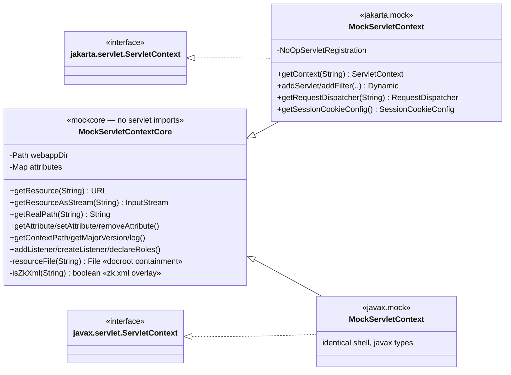
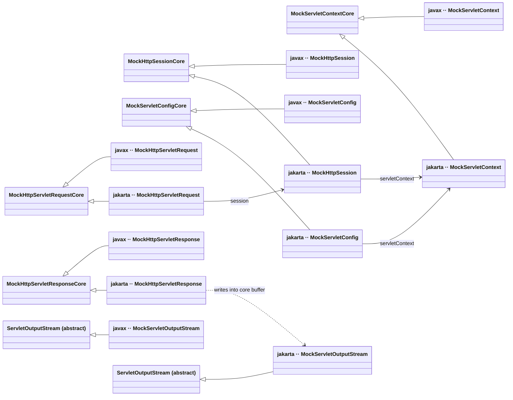
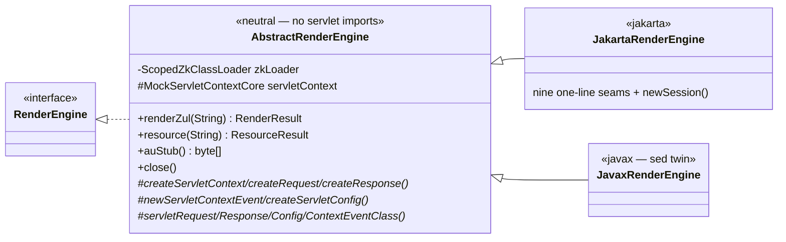

# ZUL Preview — jakarta/javax mock de-duplication (review M1)

## L1 · Executive summary

The launcher renders against ZK on both `jakarta.servlet` (ZK 10.1.0) and `javax.servlet`
(ZK CE 9.6.0.2). Each servlet mock (`MockServletContext`, `MockHttpServletRequest`,
`MockHttpServletResponse`, `MockHttpSession`, `MockServletConfig`) existed as two byte-identical
copies apart from the `package` line and `jakarta`↔`javax` imports — nothing stopped a one-sided
edit from silently diverging (review M1). The two servlet APIs share no common supertype, so a
single class can't implement both; a real design-pattern fix is needed, not a parity checker.

**Pattern: Bridge.** Extract every piece of state and behaviour whose types are servlet-agnostic
(JDK-only) into a concrete, package-agnostic `*Core` class in `org.zkoss.zkpreview.mockcore`. Each
per-namespace mock becomes a thin **adapter** — `class MockX extends MockXCore implements <servlet
interface>` — where the inherited `Core` methods automatically satisfy every interface method with a
JDK signature, and the adapter body implements only the handful of methods whose signature (or body)
actually references a `jakarta`/`javax` type. The drift-prone logic (path-traversal containment,
zk.xml overlay, header lowercasing, response capture, session attributes) now lives in exactly one
place; the irreducible per-namespace part is the interface shell Java forces on us.

Progress: implementing (behaviour-preserving refactor; verified by the existing both-variant suite).

## L2 · Phase breakdown

| Core (shared, JDK-only) | Adapter keeps (servlet-typed only) |
|---|---|
| `MockServletContextCore` — webappDir, attributes, `resourceFile`+containment, zk.xml overlay, resource/attribute/init-param/version/log/classloader methods | dispatchers, servlet/filter/listener registration stubs, `NoOpServletRegistration`, session-cookie/tracking stubs |
| `MockHttpServletRequestCore` — servletPath/pathInfo/method, headers (lowercased), attributes, URI/URL build, all constant getters | session-derived (`getSession`, `getServletContext`, id), `getInputStream`, cookies, async/upgrade, `login`/`logout` (throw `ServletException`), `getParts` |
| `MockHttpServletResponseCore` — writer+byteBuffer capture, `getContent(Bytes)`, status, headers, `sendRedirect`, encodeURL, buffer stubs | `getOutputStream` (wraps the core buffer), `addCookie` |
| `MockHttpSessionCore` — id, times, attributes, value aliases, invalidate | `getServletContext`, `getSessionContext` |
| `MockServletConfigCore` — servletName, initParams | `getServletContext` |

`MockServletOutputStream` stays per-namespace (it `extends` the servlet `ServletOutputStream`
abstract class — no shared base possible) but is reduced to writing into a `ByteArrayOutputStream`
the response core owns.

The two `*RenderEngine`s were byte-identical apart from the namespace token too, so they get the same
treatment via **Template Method**: `AbstractRenderEngine` (neutral package) owns the whole drive
logic — classloader isolation, servlet bootstrap by reflection, the render/resource service calls,
the AU stub and shutdown — and exposes nine `protected` seams for the parts whose type is tied to a
servlet namespace (constructing the mocks + the `ServletRequest/Response/Config/ContextEvent.class`
literals reflection needs). `JakartaRenderEngine`/`JavaxRenderEngine` shrink to those nine one-line
overrides and stay distinct classes so `RenderEngineFactory` and `IsolationTest` can still identify
the flavour by type. (An earlier draft judged this not worth it; it is — the seams return the typed
`*Core` bases, not `Object`, so there is no unsafe strategy soup, and the drive logic now lives once.)

**Acceptance gate:** `:zk-preview-launcher:test` stays BUILD SUCCESSFUL (baseline was green). The
both-variant tests — `MockServletContextTraversalTest`, `PathResolutionTest`, `RenderFidelityTest`,
`RealWorldSmokeTest`, `ZulSyntaxCorpusTest` — exercise the mocks through real ZK, so any behavioural
drift fails. Adapter public API (`MockServletContext(Path)`, `newSession()` → `MockHttpSession`, …)
is unchanged so the engines and tests compile untouched.

## L3 · Technical appendix

### Why not the lighter options
- **Parity test** enforces sameness but leaves two copies to hand-edit in lockstep — declined by the user.
- **Build-time codegen** dedups but is a build-system change on a release branch and moves the source of truth out of git.

### Irreducible remainder
The `@Override` interface shell (servlet-typed stubs + the one-line inheritance of JDK methods) cannot
be merged across `jakarta`/`javax` without reflection/proxies (fragile) or codegen. The Bridge removes
the *logic* duplication — the part where a silent one-sided edit is a real bug — which is M1's concern.

### Class diagram

Exemplar — the `ServletContext` family (the richest split):

All five families (interfaces omitted; each adapter `..|>` its own-namespace servlet interface):

`MockServletOutputStream` is the one mock with no shared core — it `extends` the servlet
`ServletOutputStream` abstract class (different per namespace).

The render engines follow the same shape (Template Method rather than Bridge, since they are the
`RenderEngine` implementors, not adapters over a servlet interface):

After this, `MockServletOutputStream` is the only remaining per-namespace launcher class with no
shared parent (an irreducible `extends` of the servlet abstract class).

### Change log
- **Done.** Five `*Core` classes created in `org.zkoss.zkpreview.mockcore` (JDK-only imports, so
  `CoreIndependenceTest` still passes). All 10 mock adapters reduced to `extends *Core implements
  <servlet interface>` + only servlet-typed members. `MockServletOutputStream` reworked to write into
  the response core's `ByteArrayOutputStream`. The two `*RenderEngine`s and all adapter public API
  (`MockServletContext(Path)`, `MockHttpSession(MockServletContext)`, `newSession()`, …) are
  unchanged, so engines and tests compiled untouched.
- Boundary rule applied mechanically: **a method lives in the core iff its signature references only
  JDK types AND its body needs only core state.** The listener/role no-ops (`addListener`,
  `createListener`, `declareRoles` — signatures use only `java.util.EventListener`/`String`) moved to
  the context core. Request methods whose *body* touches the servlet-typed session
  (`getRequestedSessionId`, `changeSessionId`) stay in the adapter despite their `String` signature.
- Parity: each javax adapter is the exact `jakarta`→`javax` transform of its jakarta twin (verified:
  0 residual diff lines modulo the namespace token). No stray `jakarta` token remains under `javax/`.
- Verification: baseline `:zk-preview-launcher:test` green → after refactor still BUILD SUCCESSFUL
  (incl. ~96 real `ZulSyntaxCorpusTest` renders, `RenderFidelityTest`, `RealWorldSmokeTest`, both-variant
  `MockServletContextTraversalTest`, 6-way `PreviewHttpServerConcurrencyTest`, `JakartaSessionPerRenderTest`);
  plugin `:test` green. Behaviour-preserving.

### Change log — render-engine dedup (follow-up)
- **Done.** `AbstractRenderEngine` created in `org.zkoss.zkpreview` (JDK + `mockcore` imports only —
  `CoreIndependenceTest` still passes). The two `*RenderEngine`s dropped from 127 identical lines each
  to ~90-line subclasses that are pure seam overrides (`JavaxRenderEngine` is the exact
  `jakarta`→`javax` / `Jakarta`→`Javax` transform of `JakartaRenderEngine`: 0 residual diff, no stray
  token). `newSession()` stays a package-private subclass method (covariant `MockHttpSession` return)
  so `JakartaSessionPerRenderTest` compiles untouched; the base drives it through the `createRequest`
  seam, one fresh session per call.
- Constructor-safety: the base ctor calls the seams during bootstrap; the subclasses hold **no state**
  (only construct their own mocks), so the overrides are safe to run before subclass init completes.
  `IsolatedRuntime.buildZkClassLoader(...)` now takes `getClass().getClassLoader()` — identical to the
  old hard-coded `JakartaRenderEngine.class.getClassLoader()` for the real engines.
- Test touch: `IsolationTest.zkLoaderOf` now walks the superclass chain for the `zkLoader` field (it
  moved up to `AbstractRenderEngine`); no behavioural assertion changed. All other tests untouched.
- Verification: `:zk-preview-launcher:test` (both variants) + plugin `:test` → BUILD SUCCESSFUL.
