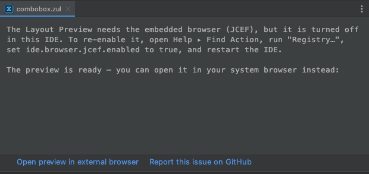

# Manual test — JCEF-unavailable diagnosis + external-browser fallback (P1)

The reason **mapping** and message text are headless-locked in `JcefAvailabilityTest`. What only a
running IDE can prove is the Swing/JCEF seam (lesson #1): that when `JBCefApp.isSupported()` is
false the preview **still starts the server** and shows the fallback card with a working
**"Open preview in external browser"** hand-off — not the old dead-end message.

## What changed
- `JcefAvailability.diagnose(...)` — pure reason mapping (registry-off / non-JBR boot JDK / generic
  incompatible) → why + how-to-fix text.
- `ZulPreviewFileEditor` — the JCEF-unavailable branch no longer early-returns: it starts the
  preview server and, on `READY`, shows the `CARD_EXTERNAL` fallback (diagnosis text + "Open
  preview in external browser" + "Report this issue on GitHub").

## Setup — force JCEF off in the sandbox
The sandbox runs on the JetBrains Runtime, so the reproducible path is the **registry** toggle
(this exercises the exact same card + external-browser wiring as the boot-JDK case).

1. `withjdk.sh 17 ./gradlew runIde`
2. In the sandbox IDE: **Help ▸ Find Action ▸ "Registry…"**, set **`ide.browser.jcef.enabled` =
   false** (uncheck it).
3. **Restart the sandbox IDE** (`JBCefApp.isSupported()` is evaluated once and cached — restart so
   it re-reads the flag).
4. Open any `.zul` in a module with ZK on the classpath (e.g. `manual-test/src/main/webapp/preview/*.zul`).

## Expect
- **Not** the old "Layout Preview unavailable … you can still edit … in the text editor" message.
- The preview pane shows the fallback card:
  - The **registry** explanation, naming `ide.browser.jcef.enabled` and telling the user to
    re-enable it and restart.
  - An **"Open preview in external browser"** link → clicking it opens the **real localhost render**
    of the ZUL in the system browser (the server did start — that's the point).
  - A **"Report this issue on GitHub"** link → opens a prefilled new-issue in the system browser.
- Re-enable `ide.browser.jcef.enabled`, restart, reopen the `.zul` → the in-pane JCEF render is back
  (regression check: the normal path still works).

Verified fallback card (registry-disabled variant):

## Boot-JDK-without-JCEF branch (`BOOT_JDK_NO_JCEF`)
Reproducing this in runIde means running the sandbox on a non-JBR JDK, which is awkward and not
required: the card, the external-browser hand-off, and the report link are the **same Swing
wiring** as the registry case above — only the diagnosis **text** differs, and that text is locked
by `JcefAvailabilityTest` (`nonJetBrainsRuntime_…`, names the JetBrains Runtime + boot runtime
setting). If you do want to see it live, run the sandbox with `runIde`'s JVM pointed at a
third-party JDK and confirm the card names the JetBrains Runtime / "Choose Boot Java Runtime".

## Status
- Headless: `JcefAvailabilityTest` (7 cases) green; full plugin suite green (316).
- Manual (runIde): **PASS** — verified by user 2026-08-03, registry-disabled variant
  (screenshot above, `doc/jcef-unavailable.png`). The fallback card shows the diagnosis + a working
  "Open preview in external browser" hand-off, not the old dead-end message.
